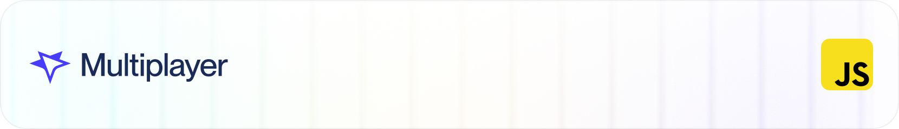
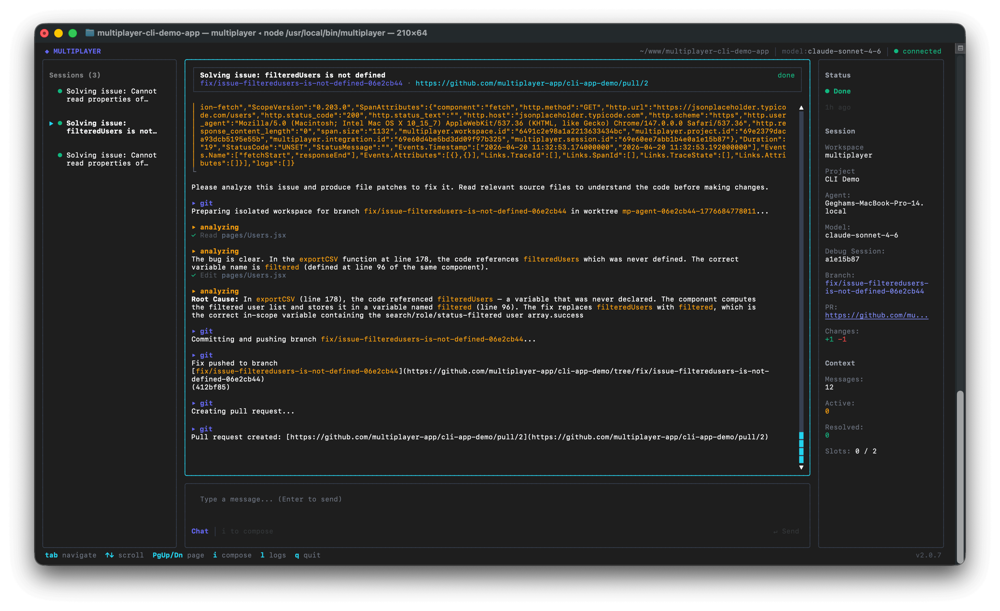
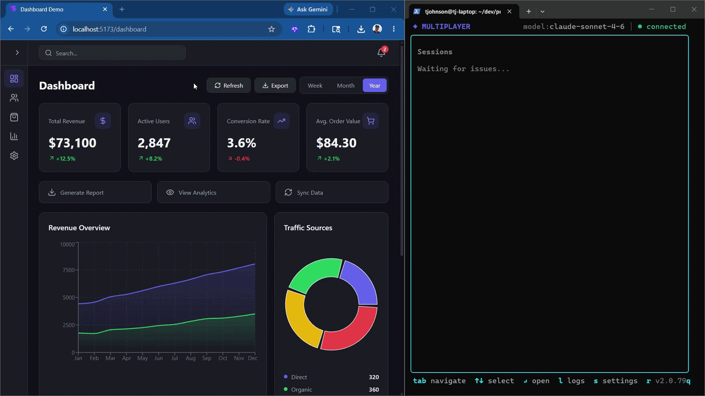
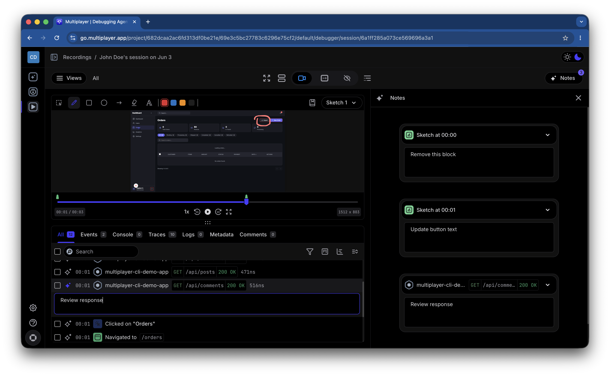

<div align="center">
  <a href="https://github.com/multiplayer-app/multiplayer/blob/main/LICENSE">
    
  </a>
  <a href="https://multiplayer.app">
    
  </a>

</div>
<div>
  <p align="center">
    <a href="https://x.com/trymultiplayer">
      
    </a>
    <a href="https://www.linkedin.com/company/multiplayer-app/">
      
    </a>
    <a href="https://bsky.app/profile/multiplayer.app">
      
    </a>
  </p>
</div>

<h1 align="center">Multiplayer</h1>

<p align="center">
  The open-source debugging agent for developers.
  We connect your favorite coding agent to prod to fix application bugs automatically. 
  Run us locally and eliminate PR slop.
</p>

<p align="center">
  <a href="https://multiplayer.app">Website</a>
  ·
  <a href="https://www.multiplayer.app/docs">Docs</a>
  ·
  <a href="https://github.com/multiplayer-app/multiplayer-cli">CLI</a>
</p>



## What is Multiplayer?

The Multiplayer debugging agent connects your favorite coding agent directly to production to fix application bugs automatically. 

Multiplayer runs securely and locally alongside tools like Claude Code (GA), Codex (private beta), and Copilot (private beta). Only when it detects an error or exception anywhere in your stack it sends runtime session data to your coding agent, managing the whole process from bug identified to bug fixed: data gathering, intelligent triage and issue deduplication, coding agent prompting, PR creation and user notification.  

The session data fed to the coding agents is full-stack, auto-correlated, and unsampled. It also includes data observability tools miss such as request/response content and headers from all components in your system. 

This repository contains the self-hostable agent: the web app, backend services, data pipelines, storage integrations, and shared libraries that power Multiplayer.

## Highlights

- **Plug and play with your own agent**: we run locally right next to your favorite coding agent so you can fix application bugs in production.
- **Better data for coding agents and humans**: APMs heavily sample and miss critical content. We capture and correlate deep, unsampled data across your entire system (frontend to backend), giving your agent the complete runtime picture.
- **Intelligent issue triage and deduplication**: we filter for high-priority bugs and group identical errors locally. You get one high-quality, merge-ready fix for critical issues, instead of an avalanche of duplicate PRs for the same bug.
- **Multiplayer CLI:** Use the terminal UI to work through sessions, inspect context, ask an agent to debug, and turn fixes into branches or pull requests.
- **Open SDK ecosystem:** Capture sessions from JavaScript, React Native, Go, .NET, Python, Ruby, and Java applications.
- **Self-hostable stack:** Run the platform locally with Docker Compose, PM2, Turborepo, MongoDB, RabbitMQ, Redis, Kafka, ClickHouse, MinIO, OpenSearch, and OpenTelemetry.

## Multiplayer CLI

The [Multiplayer CLI](https://github.com/multiplayer-app/multiplayer-cli) brings the debugging workflow into the terminal. It is designed for agent-assisted investigation: connect a session, inspect the collected evidence, reason over code and runtime context, and produce a concrete fix.



Use the CLI when you want to:

- hand an AI agent the exact session and code context for a bug;
- investigate issues without switching between the dashboard, terminal, and browser tools;
- create a branch or pull request from the debugging flow;
- keep the full debugging trace attached to the fix.

See the [multiplayer-cli repository](https://github.com/multiplayer-app/multiplayer-cli) for installation and usage instructions.

## Multiplayer web dashboard

The Multiplayer web dashboard gives teams a shared debugging workspace for debugging sessions. Engineers can review the conversation between the Multiplayer debugging agent and their coding agent and dive into the specific session data (full-stack session recordings) and how the issues were identified and grouped (issues).



Use the web dashboard when you want to:
- review the debugging sessions across all Multiplayer debugging agents in your team;
- resume or edit a debugging session to update a bug fix and generate a new PR;
- review the issues identified in your platform;
- review the data gathered per bug identified and replay the user journey, inspect events and requests;
- annotate session recordings and keep notes tied to the exact runtime evidence that produced the issue.

## What's in this repo?

- `clients/multiplayer-web-app` - the Multiplayer web application.
- `services/*` - backend services for API, auth, git integrations, collaboration, notifications, assets, versioning, and radar/debugging workflows.
- `libs/*` - shared platform libraries for auth, models, storage, messaging, telemetry, logging, MCP, and service utilities.
- `scripts/*` - local development, infrastructure, migrations, seed data, and PM2 orchestration.
- `docs/img/*` - README and product preview assets.

## Requirements

- [Node.js](https://nodejs.org/) v22+
- [pnpm](https://pnpm.io/) v10+ (`npm i -g pnpm`)
- [Docker](https://www.docker.com/) and Docker Compose
- [PM2](https://pm2.keymetrics.io/) and [bunyan](https://github.com/trentm/node-bunyan) (`npm i -g pm2 bunyan`)

For Docker Compose deployment (recommended): only Docker and Docker Compose are required.

For local development with PM2: Node.js, pnpm, PM2, and bunyan are also required.

## Running with Docker Compose (Recommended)

`docker/docker-compose.prod.yml` starts the full platform using prebuilt images from Docker Hub — all infrastructure (MongoDB, RabbitMQ, Redis, Kafka, ClickHouse, MinIO, OpenSearch, OpenTelemetry collector) plus all application services (API, auth, radar, git, collaboration, assets, notifications, version, nginx).

### 1. Configure environment

Copy the example env file into the `docker/` directory, where the compose file expects it:

```bash
cp .env.example docker/.env
```

Edit `docker/.env` and fill in any required credentials. Stripe and email integrations can be left blank unless you need them.

### 2. Start the platform

```bash
docker compose -f docker/docker-compose.prod.yml up -d
```

All services use health checks and will come up in dependency order.

### Stopping

```bash
# Stop containers
docker compose -f docker/docker-compose.prod.yml down
```

## Local Development

### 1. Install dependencies

```bash
pnpm install
```

### 2. Configure environment

```bash
cp .env.example .env
```

Review `.env` before starting the platform. Most local defaults are defined in `pm2.config.yml`; external provider credentials such as Stripe or email providers are only needed when testing those integrations.

### 3. Start infrastructure

Start just the infrastructure dependencies with the dev compose file:

```bash
docker compose -f docker/docker-compose.dev.yml up -d
```

### 4. Start the platform

```bash
pnpm start:pm2
```

This starts Docker Compose, builds the platform libraries and services, runs migrations, seeds required roles, and launches the web app and backend services with PM2.

Open [http://localhost](http://localhost) when startup completes.

### PM2 commands

- `pm2 stop all` - stop all services.
- `pm2 restart {{SERVICE_NAME}}` - restart one service, for example `pm2 restart auth`.
- `pm2 restart all` - restart all services.
- `pm2 delete all` - remove all services from PM2.
- `pm2 logs {{SERVICE_NAME}}` - view logs for one service.
- `pm2 logs {{SERVICE_NAME}} --raw | bunyan` - view formatted logs for one service.

## Useful Commands

```bash
pnpm build
pnpm lint
pnpm stop:pm2
pnpm migrate:up
pnpm migrate:down
pnpm seed-roles
```

## Related Projects

- [multiplayer-cli](https://github.com/multiplayer-app/multiplayer-cli) - terminal UI and agent workflow for Multiplayer debugging sessions.
- [multiplayer-session-recorder-browser](https://github.com/multiplayer-app/multiplayer-session-recorder-javascript/tree/main/packages/session-recorder-browser) - Session Recorder Browser.
- [multiplayer-session-recorder-node](https://github.com/multiplayer-app/multiplayer-session-recorder-javascript/tree/main/packages/session-recorder-node) - Session Recorder Node.js.
- [multiplayer-session-recorder-react](https://github.com/multiplayer-app/multiplayer-session-recorder-javascript/tree/main/packages/session-recorder-react) - Session Recorder React.
- [multiplayer-session-recorder-react-native](https://github.com/multiplayer-app/multiplayer-session-recorder-javascript/tree/main/packages/session-recorder-react-native) - Session Recorder React Native.
- [multiplayer-session-recorder-go](https://github.com/multiplayer-app/multiplayer-session-recorder-go) - Go session recorder SDK.
- [multiplayer-session-recorder-dotnet](https://github.com/multiplayer-app/multiplayer-session-recorder-dotnet) - .NET session recorder SDK.
- [multiplayer-session-recorder-python](https://github.com/multiplayer-app/multiplayer-session-recorder-python) - Python session recorder SDK.
- [multiplayer-session-recorder-ruby](https://github.com/multiplayer-app/multiplayer-session-recorder-ruby) - Ruby session recorder SDK.
- [multiplayer-session-recorder-java](https://github.com/multiplayer-app/multiplayer-session-recorder-java) - Java session recorder SDK.

## Documentation

Start with the [Multiplayer docs](https://multiplayer.app/docs) for product concepts, SDK setup, and hosted-platform usage. Service-specific setup notes live in the README files under `services/*` and library-specific notes live under `libs/*`.

## Contributing

Please read [CONTRIBUTING.md](CONTRIBUTING.md) for the branching strategy and commit conventions.

## License

Multiplayer Platform is released under the [MIT License](LICENSE).
